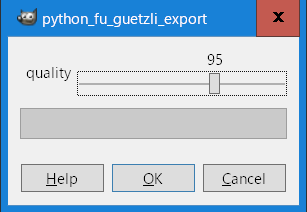

# gimp-plugins [GitHub](https://github.com/umyuu/gimp-plugins)

3rd Party
gimp-plugins Guetzli executable file call wrapper. 

## Install
1. [download a ZIP](https://github.com/umyuu/gimp-plugins/archive/master.zip) file.

   plug-ins Directory copy to GIMP plug-ins Directory.

2. Guetzli executable file copy to GIMP plug-ins Directory.

[FYI:setup.txt](docs/setup.txt)

## Plugin Run.
1. Run GIMP

2. Open jpg/png Image File

3. File Menu -> Export -> Save guetzli

   
